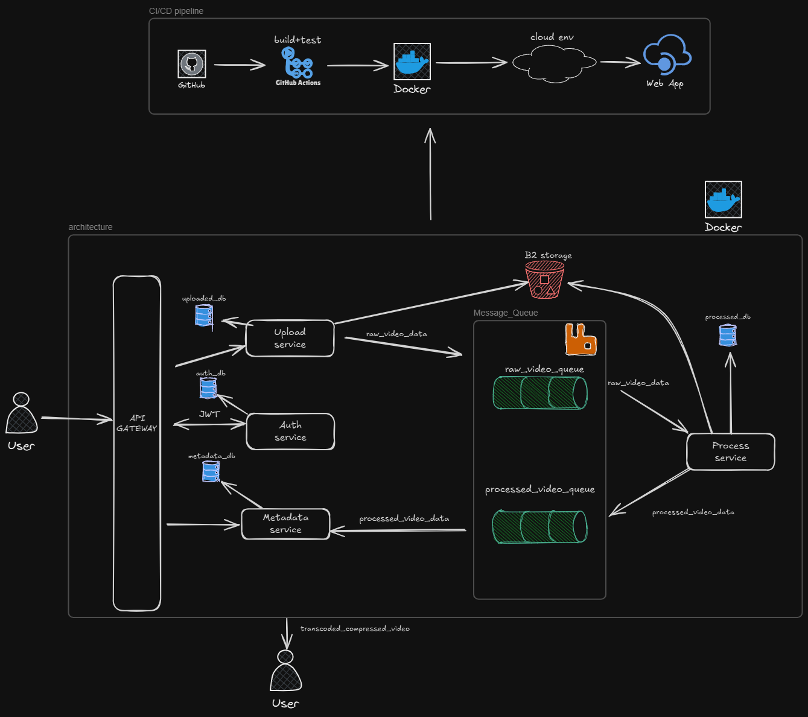

# 🎥 Video Transcoding and Compression As a Service

## 🚀 Project Overview

This project delivers a **Video Transcoding and Compression As a Service** platform designed for video streaming companies.  
Our system efficiently processes raw video files uploaded by clients, transcoding them into multiple device-compatible formats and compressing them to optimize storage and streaming performance — all handled seamlessly in the cloud.

---

## 🏗️ Architecture & Components

The solution follows a **event driven microservices architecture** composed of four specialized services:

| Service             | Responsibility                                               | Deployment                          |
|---------------------|--------------------------------------------------------------|-----------------------------------|
| **upload-service**   | Handles client video uploads and temporary file storage      | Azure Web Service for Containers   |
| **process-service**  | Manages transcoding and compression pipelines                 | Azure Web Service for Containers   |
| **metadata-service** | Stores video metadata and tracks processing status           | Azure Web Service for Containers   |
| **auth-service**     | Secures the system with authentication and authorization     | Azure Web Service for Containers  |

Services communicate asynchronously via **RabbitMQ**.

Video files are stored on **Backblaze B2**, ensuring scalable and cost-efficient cloud storage.

The **Traefik API Gateway** manages routing and middleware for all services and is deployed on **Render**.

---

## ⚙️ Technology Stack

- **Backend:** Node.js & Express.js  
- **Messaging:** RabbitMQ (hosted on Render) for async communication  
- **Storage:** Backblaze B2 cloud storage  
- **Containerization:** Docker & Docker Compose  
- **API Gateway:** Traefik (Render)
- **Cloud:** Azure 
- **Security:** JWT-based authentication & authorization  
- **Architecture:** RESTful APIs with event-driven microservices  
- **CI/CD:** GitHub Actions automating build, test, and deployment pipelines for all services and pushing Docker images to Docker Hub

---

## 📊 Architecture Diagram

*The diagram illustrates the flow between clients, API Gateway, microservices, RabbitMQ messaging, and cloud storage.*

---

## ⚡ Key Features

- Multi-format video transcoding & compression tailored for device compatibility  
- Decoupled, scalable microservices architecture  
- Secure, centralized authentication and service authorization  
- Asynchronous processing with RabbitMQ to improve throughput  
- Cloud-native video storage with Backblaze B2  
- API Gateway routing and middleware management with Traefik  
- Automated CI/CD pipelines with GitHub Actions for continuous delivery

---

## 🚀 Deployment & CI/CD

- All backend services are containerized with Docker and deployed on **Azure Web Services for Containers** for easy scalability and management.  
- **RabbitMQ** is containerized, offering a managed and reliable messaging layer.  
- Traefik API Gateway runs on **Render**, routing external traffic to internal services securely.  
- CI/CD pipelines implemented with **GitHub Actions** automate:  
  - Running unit and integration tests  
  - Building Docker images for each microservice  
  - Pushing images to Docker Hub  
  - Deploying/updating services on Azure and Render  

---

